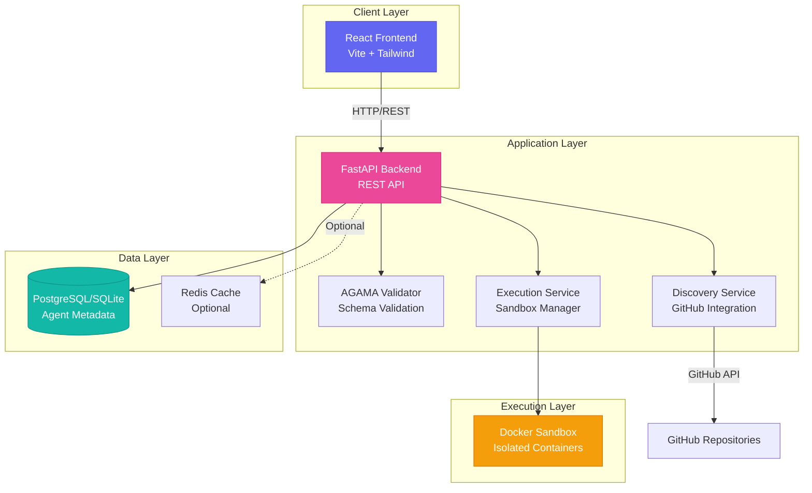
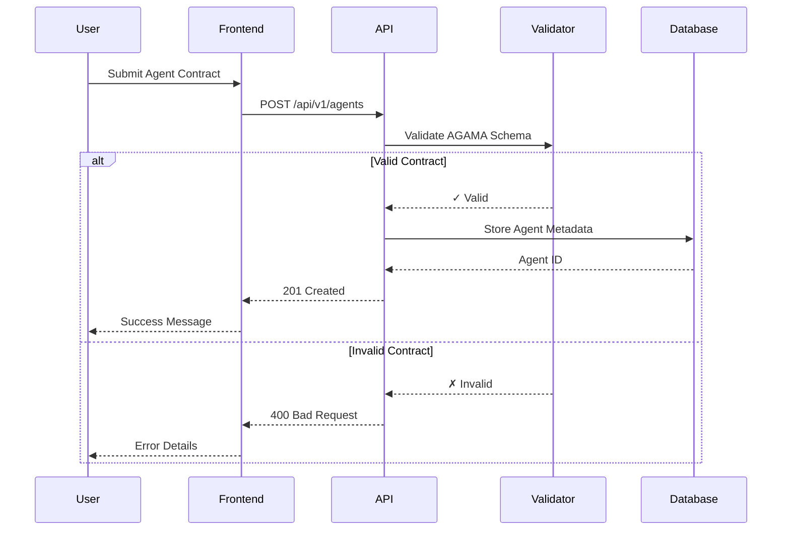
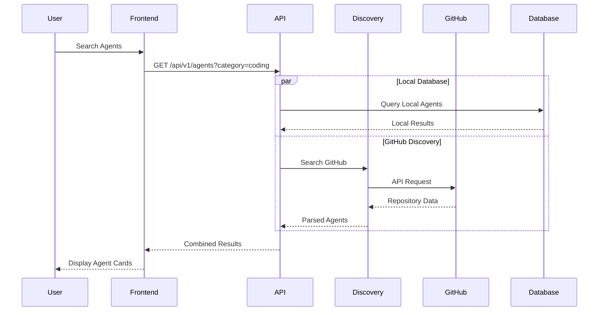
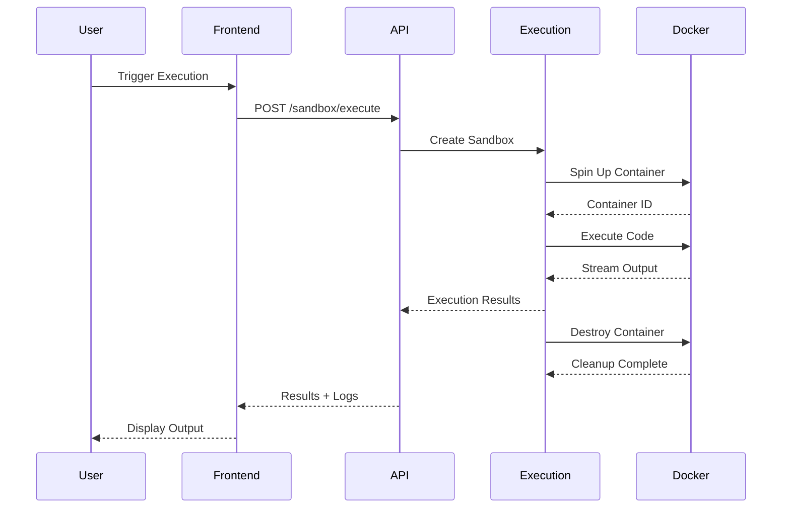
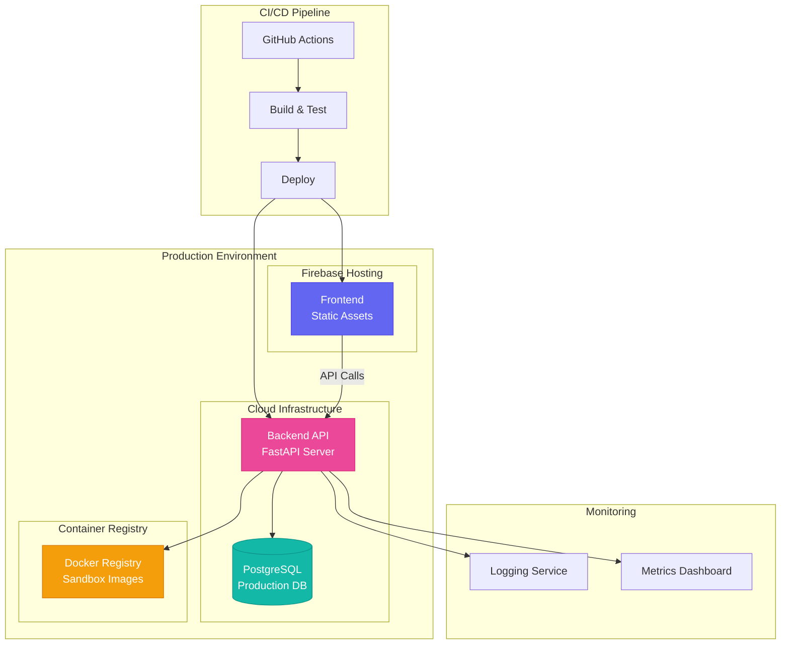

# AgentsPlatform Architecture

## High-Level Overview

AgentsPlatform (ĀGAMA) is built as a modular system designed for scalability and extensibility.

### Core Components

1.  **Frontend (React/Vite)**:
    - **Purpose**: Provides a user interface for discovering, deploying, and interacting with agents.
    - **Tech Stack**: React 18, Vite, Tailwind CSS, Framer Motion.
    - **Key Features**:
      - Glassmorphic UI design.
      - Real-time interaction with backend APIs.
      - Dynamic SVG graphics (HeroBackground, CategoryAvatar).

2.  **Backend (FastAPI)**:
    - **Purpose**: Manages data persistence, API endpoints, and business logic.
    - **Tech Stack**: Python 3.9+, FastAPI, SQLAlchemy, Pydantic.
    - **Key Modules**:
      - `api/`: RESTful endpoints.
      - `services/`: Business logic (Discovery, Execution).
      - `schemas/`: Data validation models (AgamaContract).

3.  **Database (PostgreSQL/SQLite)**:
    - **Purpose**: Stores agent metadata, user information, and logs.
    - **Schema**:
      - `agents`: Core table storing `AgamaContract` JSON and metadata.

4.  **Sandbox (Docker)**:
    - **Purpose**: Executes untrusted agent code in isolated containers.
    - **Workflow**:
      1. User/Agent submits code.
      2. Backend validates request.
      3. `ExecutionService` spins up a Docker container.
      4. Code runs, output is captured.
      5. Container is destroyed.

## Data Flow

### Agent Registration Flow

### Agent Discovery Flow

### Code Execution Flow

## Deployment Architecture

## Security Considerations

1. **Sandbox Isolation**: All agent code runs in ephemeral Docker containers with resource limits.
2. **Input Validation**: AGAMA contracts are validated against strict JSON schemas.
3. **API Authentication**: JWT-based authentication for protected endpoints (future).
4. **Rate Limiting**: Prevents abuse of execution and discovery services.

## Scalability

- **Horizontal Scaling**: Backend API can be scaled across multiple instances.
- **Caching Layer**: Redis for frequently accessed agent metadata.
- **CDN**: Static assets served via Firebase CDN.
- **Database Replication**: Read replicas for high-traffic scenarios.
